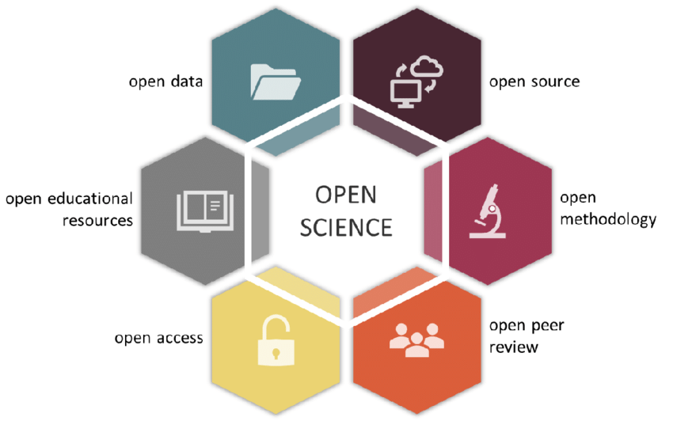
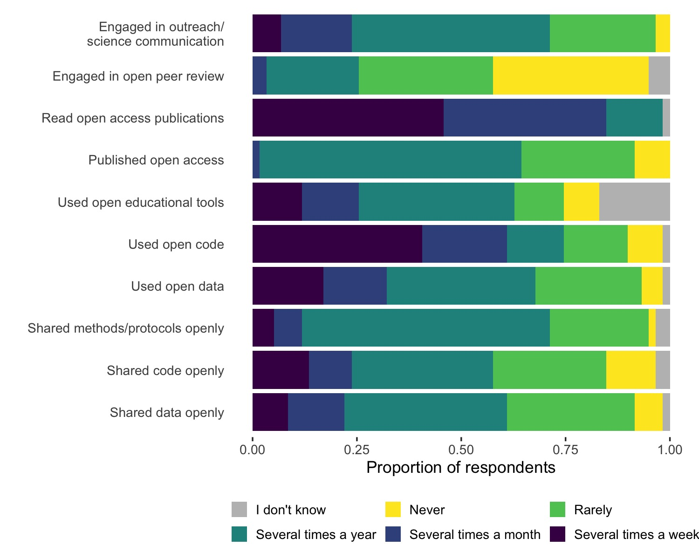
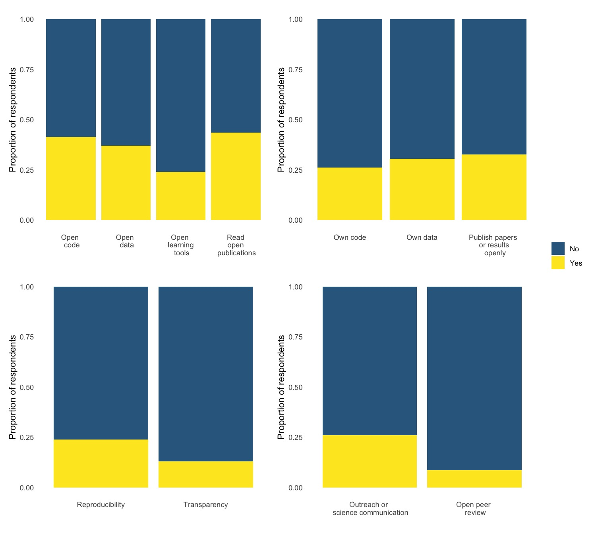
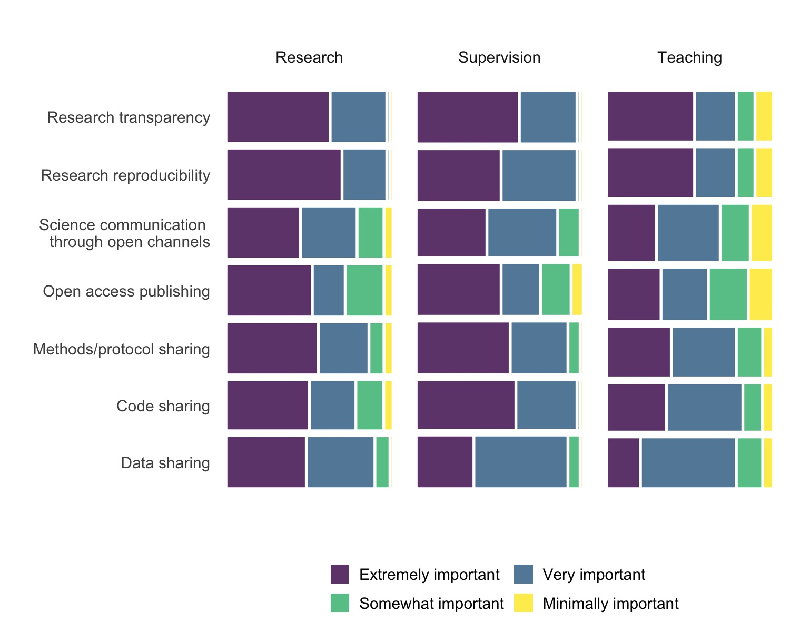
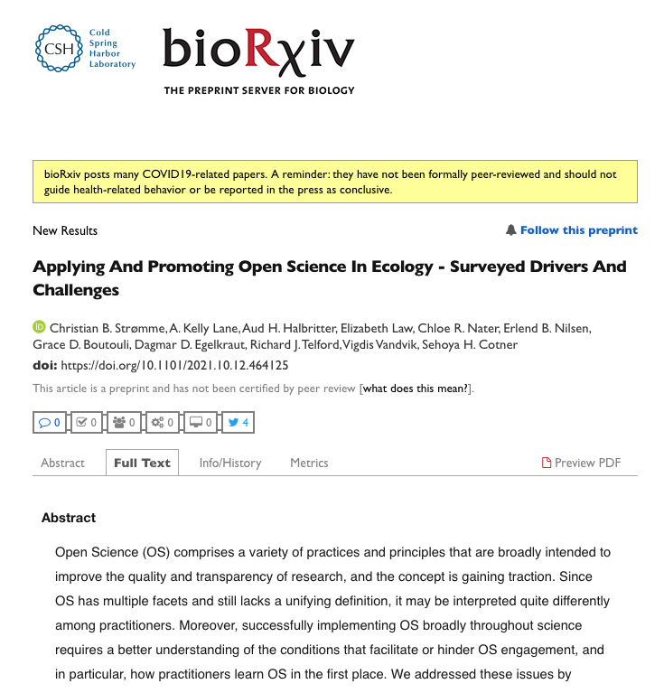

layout: true

<div class="my-footer"><span> Living Norway 2021    
&emsp;&emsp;&emsp;&emsp;&emsp;&emsp;&emsp;&emsp;&emsp;&emsp;&emsp;&emsp;&emsp;
&emsp;&emsp;&emsp;&emsp;&emsp;&emsp;&emsp;&emsp;&emsp;&emsp;&emsp;&emsp;&emsp;
                    @audhalbritter <a href="https://twitter.com/audhalbritter">`r shiny::icon("twitter")` </a>
                    audhalbritter <a href="https://github.com/audhalbritter">`r shiny::icon("github-alt")` </a>
                    </span></div> 

```{r setup, include=FALSE}
knitr::opts_chunk$set(echo = FALSE)
library(drake)
library(tidyverse)
library(kableExtra)

```


---


# Open Science practices

.pull-left[
Open science (OS), reproducible and transparent research practice is becoming more common in the scientific community.

This demands changes at the individual and institutional level:

* new infrastructure (e.g. databases)
* re-defining publishing models
* licensing
* data and metadata standards
* funding schemes
* research practise
]

.pull-right[

&nbsp;
&nbsp;
&nbsp;
&nbsp;
&nbsp;


]


---


# Challenges related to OS practices

OS practises are not widely implemented across research communities, but rather within select groups, networks or events (Besancon et al., 2021).

OS is perceived differently in terms of values, required skills and pragmatic trade-offs between benefits and costs (Kathawalla et al., 2021)

Major cultural and behavioural shift among scientists is required

--

&nbsp;

*Understanding of how OS practices and principles are learned, understood, and transmitted to other researchers and students can better inform institutions and policymakers how to implementing OS practices*


.footnote[Besancon et al., Open science saves lives: lessons from the COVID-19 pandemic. BMC Research Methodology. 2021;21  
Kathawalla et al., Easing into open science: A guide for graduate students and their advisors. Collabra Psychology. 7]

---


# Questions

How are OS practices and principles are learned, understood, and transmitted to other researchers and students?

* How is OS perceived among practitioners in ecology?

* Which OS aspects do practitioners interact with, and how frequently?

* What are the perceived benefits and risks for individual engagement in OS?

* Which OS aspects have practitioners encountered in their own formal education?

* How do OS practitioners that are involved in higher education value OS in teaching and supervision of students?


---


<!-- # Hypothesis -->

<!-- * Researchers with academic affiliation have engaged more in open science-related practices compared to other researchers, and more so for early-career researchers -->

<!-- * Workshop participants use open data more frequently rather than contributing with open data and code. -->

<!-- * Researchers who teach are more likely to include open science-related practices in their teaching if they also frequently engage in those practices as researchers. -->

<!-- * Colloquium participants having more experience with being taught open science-related practices are more likely to engage in those practices. -->

<!-- * Colloquium participants perceive OS practices to be more important in their research compared to teaching and supervision. -->


<!-- --- -->


# Method and analysis

Digital survey in 3 parts (before/during/after event)

Combination of questions:

* constrained choice: background information such as degree, affiliation, gender, and experience with OS aspects

* Likert-scale: experience with and perceived importance of different OS aspects to research, teaching, and supervision

* open-ended questions: define OS and describe what has helped and hindered their OS engagement


A combination of qualitative and quantitative analysis.


---


# Results


```{r table}

tribble(
  ~"", ~"", ~"",
  "Part 1", "Part 2", "Part 3",
  "60", "51", "39",
  "Norway", "EU", "None-EU",
  "45", "8", "13",
  "University", "Research institute", "Other",
  "37", "22", "7",
  "None binary", "Female", "Male",
  "1", "27", "32"
) %>% 
  kbl() %>% 
  pack_rows("Participants", 1, 2) %>% 
  pack_rows("Affiliation", 3, 6) %>% 
  pack_rows("Sex", 7, 8) %>% 
  column_spec(1:3, width = "10em") %>% 
  kable_minimal()

```


---


# How do you define Open Science?


```{r define-freq-table}
loadd(define.freq.table)

out <- define.freq.table %>%
  rename(A = `Code or Category`, B = "Number of occurrences in sample responses (before workshop; n=60)", C = "Number of occurrences in sample responses (after workshop; n=38)") %>% 
  mutate(B = as.numeric(B),
         C = as.numeric(C))
  # mutate(B = as.numeric(B) / 60 * 100,
  #        C = as.numeric(C) / 38 * 100)

out  %>% 
  kbl(booktabs = TRUE,
        digits = 1,
        col.name = c("Code or category", "before (n = 60)", "after (n = 38)"),
        caption = "Percentage with which codes were identified in the survey responses") %>% 
  add_header_above(c(" " = 1, "Percentage" = 2)) %>% 
  column_spec(1, color = "white",
               background = spec_color(out$B, end = 0.7, option = "inferno" , direction = -1)) %>% 
  kable_styling(font_size = 16)

```


---


# How do you define Open Science?

<center>

&nbsp;  
&nbsp;  
&nbsp;  

"Open science is the ideal of free and accessible availability for everyone to all components of the scientific cycle. Open science entails **open education**, open research protocols, open methodologies, open data, open code, open data management and analysis, open research publication opportunities, open research readership opportunities, open data synthesis, open science-policy interface, and an open research funding and open science system, science policy and science management.”


---


# Interaction in OS aspects

<center>


 
</center>


---


# Perceived risks

```{r $hinder freq.table$}
loadd(hinder.freq.table)
hinder.freq.table %>%
  mutate(across(where(is.character))) %>%
  mutate(across(where(is.character), linebreak)) %>%
    kbl(booktabs = TRUE,
        escape = FALSE,
        col.names = linebreak(c("Code", "Number of occurrences (n=60)"), align = "c"),
        caption = "What hinders your engagement in OS?") %>% 
  row_spec(1:3, color = "white", background = "#440154FF") %>% 
  kable_styling(font_size = 16)
```


---


# Perceived risks

&nbsp;  
&nbsp;  
&nbsp; 

“lack of familiarity with relevant **online platforms, software, methods** ... perception that the landscape of the above tools **changes** very quickly, and keeping up is a big time commitment... fear of **doing it wrong**.”


---


# Perceived benefits

```{r $help freq table$}
loadd(help.freq.table)
help.freq.table %>%
  mutate(across(where(is.character))) %>%
  mutate(across(where(is.character), linebreak)) %>%
    kbl(booktabs = TRUE,
        escape = FALSE,
        col.names = linebreak(c("Code", "Number of occurrences (n=60)"), align = "c"),
        caption = "What helps your engagement in OS?"
       )  %>% 
  row_spec(1:2, color = "white", background = "#440154FF") %>% 
  kable_styling(font_size = 16)
```


---


# Perceived benefits

&nbsp;  
&nbsp;  
&nbsp; 

“Abundance of **open-source software, preprint servers, sci-hub** (what a gem this is!), github, abundance of data repositories, **support from colleagues**.”


---


# OS aspect in own formal education?

<center>


 
</center>


---


# Research, supervision and teaching


<center>


 
</center>


---


# Take home message 


1) OS is mainly understood in terms of shared and accessible data, code and publications 

2) Individual OS engagement can be facilitated through education

Integrating OS principles and practices more formally into higher education, we can naturally address the implementation barriers that depend on individual experience with OS.


---


# Thank you for listening

.pull-left[

## Preprint


]


.pull-right[

## GitHub repo

&nbsp;  
&nbsp;  
&nbsp; 


]